# ElementTree的挂载的形成

## RootElement的挂载-->树的形成

1. 从runApp() 中开始组装:  
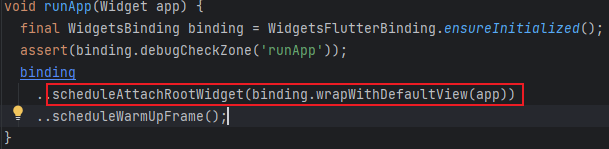
2. 实例RootWidget，并将用户定义widget当作child传递给root:  
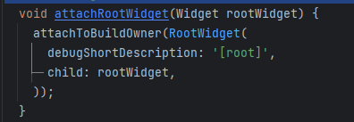
3. 创建RootWidget的Element实例RootElement，将BuildOwner(构建管理器)存储在RootWidget的_owner中，并通过其中owner.buildScope()开始树的挂载  
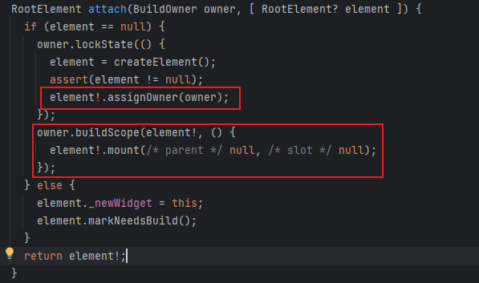
4. 触发RootWidget的mount方法，并传递两个值为空的参数，然后调用_rebuild()，其中调用父级Element的updateChild  

    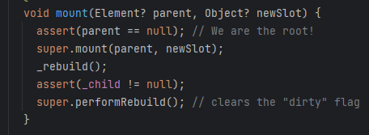  
    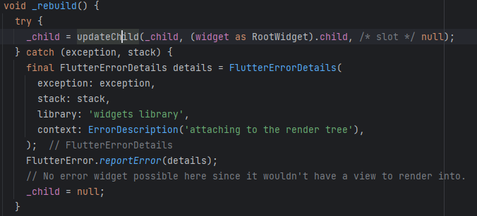  
5. updateChild接受两个参数，一个_child当前为空，一个为RootWidget的child，也就是之前传给RootWidget的用户widget。  
Element.updateChild在第一个入参的child为空时只做了一件事：调用Element.inflateWidget()，传参为newWidget和空  
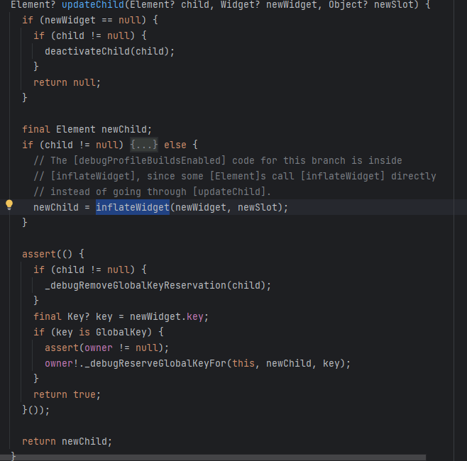  
6. Element.inflateWidget现在接受了两个参数(newWidget->这时候是指RootWidget的child，newSolt->null)：做了两件事:

    1. 调用newWidget.createElement()，创建子element实例。这里点进去查看，发现createElement函数是定义在Widget中  
    2. 调用子组件的element的mount函数，并将当前element当作参数传进去(这里的当前element是指RootWidget的elememt)，并将childElement当作返回值弹栈  
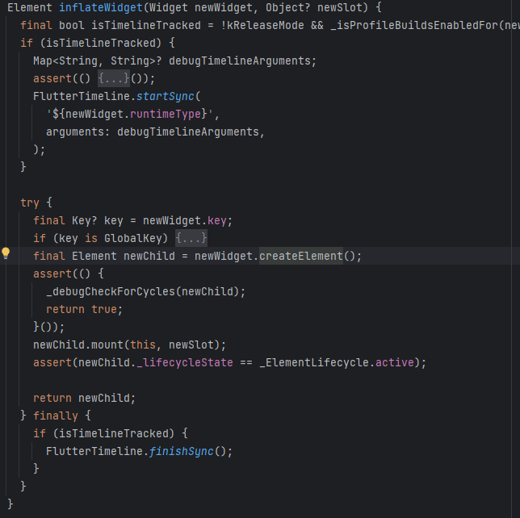  
newChild出栈做了什么：  
      回到Element.updateChild，然后继续将newChild弹出栈，然后回到RootWidget的Element中，将newChild赋值给_child，这里_child定义在RootElement中，即RootWidget持有子树
    那子树怎么找父级：newChild.mount(this,newSolt)，这里的参数this是指父级element，newChild是指子级element，那么在执行子级挂载的时候将父级当作参数传进去了，做了什么呢：
    i. 将子element._parent指向父级，完成父子的关联
    ii. 将子_element._owner指向父级的owner，完成构建管理器的传递  
    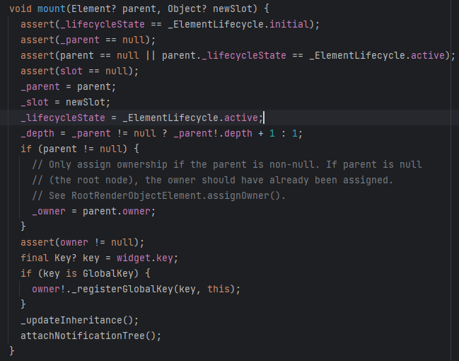
7. 现在就简单形成一个mount到mount的调用，形成一个父与子，子与父的一个关联，不过当前所看的是RootElement的一个关联，他的父与子的关联_child定义在本身没有通用性，子与父的关联定义在element中，mount()也是通过@mustCallSuper标注标记，所以具有通用性，那么其他Element是怎么实现父与子的关联的，理解之后也就完成mount到mount的闭环，直到完成所有child的挂载，形成element树  

## ComponentElement的挂载  

_ComponentElement的继承关系:_  
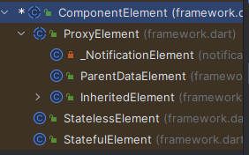  

#### 1.首先看组合型Element定义的方法

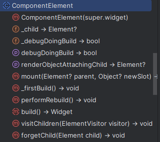  

#### 2. 现在假设某个继承了CompoentElement的Element被父级调用mount方法,然后按照流程走一遍

1. 父级element调用当前的mount()，参数parent为父级element：  
 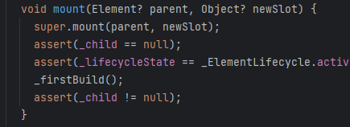  
    **先调用super.mount，将parent指向父级，将_owner指向parent.owner**  
2. 调用_firstBuilde()  
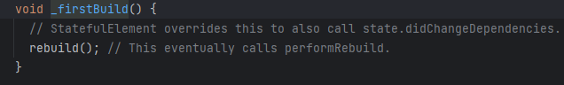

3. 调用rebuild()，这里的rebuild是所继承element的函数  
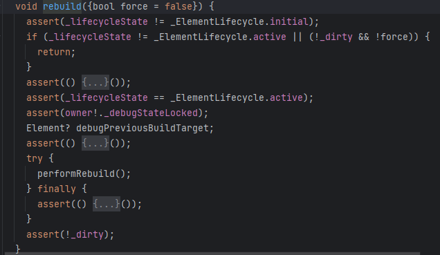

4. 调用performRebuild()：ComponentElement重写了实现，主要目的是通过调用自身定义的build接口获取childWidget(这里的build必须由子类重写)，然后再调用childWidget中的updateChild()  
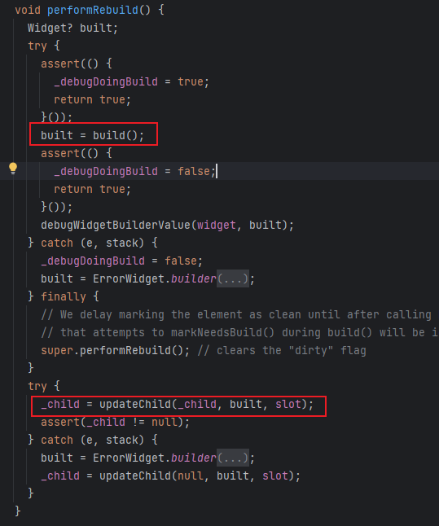  
5. 之后就到了Element.updateChild，然后Element.inflateWidget再到调用childElement的mount的标准流程  

#### 3. 平时常用StatelessWidget创建的StatelessElement与StatefulWidget创建的StatefulElement都是继承与ComponentWidget，它们又分别在挂载时做了哪些操作呢？

1. StatelessElement:  
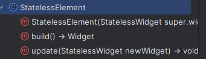  
重写build调用了StatelessWidget的build()方法,所以只是在performRebuild()中调用了StatelessWidget的build()方法,然后其他流程一致
2. StatefulElement:  
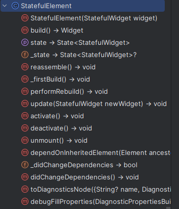  
相比于StatelessElement多了一个_state的定义,看它的类型就是StatefulWidget的State，再创建StatefuleWidget时重写的State类,那么挂载时是怎么处理这个_state的呢？ 

    **1**. StatefulElement没有重写mount方法，所以调用的是ComponentElement的mount方法,然后调用了_firstBuild():  
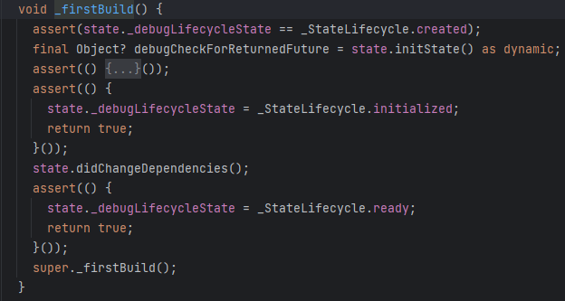  
其中主要做的是state生命周期的回调,包括initState()和didChangeDependencies(),对于initState的返回值还做了非Future的断言,然后通过super._firstBuild()调用了rebuild()  

    **2**. rebuild()调用了performRebuild()，performRebuild()调用了StatefulElement重写的build()  
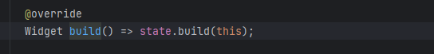  
重写很简单,直接调用并返回state的build(this),this则是指当前element,也就是在State.build(BuildContext context)中的context(这里也就说明context的本质是Element)  

    **3**. 之后performReBuild继续执行,就是Element.updateChild()，Element.inflateWidget()，childElement.mount()的标准流程.  
这里StatefulElement重写了performReBuild()  
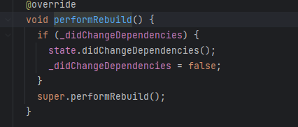  
但是在挂载的过程中并没有改变过_didChangeDependencies,一直等于false,所以不会触发两遍的state.didChangeDependencies()  

    **4**. 到这里挂载流程就结束了,但是发现一个问题,一直在调用_state,但是没有赋值,_state的初始化再哪里呢?  
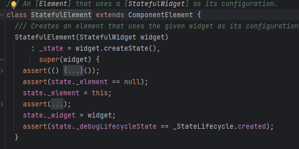  
是在StatefulElement的构造函数中.回看上面,是谁调用了StatefulElement的构造函数呢?  
实在ELement.inflateWidget()时就调用了Widget.createElement()  
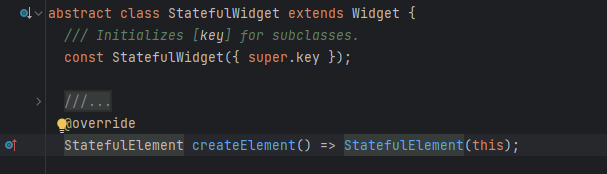  
StatefulWidget.createElement()返回的就是StatefulElement实例,并将widget本身当作参数传给Element.  
接着看构造函数.除了createState外,还将widget通过super方式传给Element持有,将当前Element传给State持有,将widget传给state._widget持有
